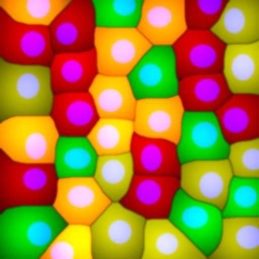

# Multiplex Tissue Colocalization

## Description

This repository contains an ImageJ macro designed for quantifying the spatial relationship, specifically the distance, between different cell populations within an image acquire in fluorescence microscopy.

In brief, the macro's workflow begins by employing the pre-trained Stardist neural network [1] to accurately segment cell nuclei based on the DAPI signal. Following nuclear segmentation, a seeded watershed algorithm [2] is applied to delineate individual cell boundaries originating from these nuclei. Concurrently, an intensity mask is generated across all imaging channels.

For each segmented cellular region and within each channel, the median fluorescence intensity is measured. Cells are then classified as positive using their median intensity compared against a defined global threshold for each marker. Subsequently, the spatial distribution of cells expressing various combinations of these markers is computationally mapped onto the image. For example, the macro identifies and maps cells exhibiting the following marker profiles: Cy3-positive and Cy5-negative, Cy3-negative and Cy5-positive, and Cy3 and Cy5 double-positive. By mapping these marker combinations, the macro enables the computation of a distance transform. This allows for the recording of the distance of a designated reference cell population (e.g., FITC-positive cells) to each of the other identified cell populations. The macro outputs the average distance of the reference cell population to each target cell population, and this value can be normalized by the total area of the analyzed sample.

A synthetic example for the problem would look the following image:

## Installation
To use this code, you need to install [Fiji](https://imagej.net/software/fiji/downloads) and activate the following update sites: [CSBDeep](https://imagej.net/plugins/csbdeep), [Startdist](https://imagej.net/plugins/stardist), [IJPB-plugins](https://imagej.net/plugins/morpholibj).

The code was tested with Fiji 1.54f.

## Usage

The analysis can be reduced to pre-defined ROI if ROIs are saved in the TIFF file. To create ROI, open the image in FIJI, create a selection and save the image as a TIF file.

To process the image files, open the macro Multiplex_Tissue_Colocalization.ijm in Fiji and press run or batch. The following window will appear:

Select the file(s) you want to process and set the next parameters
- Channel names: enter the name of the channels in order and matching the actual number of channels separated by commas, for example: DAPI,FITC,Cy3.
- Channel with nuclei labeling: enter the name of the channel corresponding to the nuclear marker, for example: DAPI.
- Reference channel:Name of the channel used to compute distance to, for example FITC.
- Combined channels code: code for the regions based on the channels intensity used to defined cell classes, for example: Cy3+ is a region positive for the Cy3 channel, Cy3+:FITC+ is a region positive for Cy3 and FITC.
- Save: indicate whether results should be saved.
- Action: Set the operating mode of the macro: either "Run" to process images or "Check" to load previously generated results. A "Test" mode can be used to check that the macro is working correctly.

The results are saved as 
- {filename}-results-table.csv: a table with intensity and distance measurements
- {filename}-rois.zip: segmented ROIs
- {filename}-summary-table.csv
- {filename}-cell-mean-intensity.tif
- {filename}-masks.tif

Additional visualization of the map of selected classes are also generated.

## References
[1] Uwe Schmidt, Martin Weigert, Coleman Broaddus, and Gene Myers. Cell Detection with Star-convex Polygons.
International Conference on Medical Image Computing and Computer-Assisted Intervention (MICCAI), Granada, Spain, September 2018.

[2] Legland, D., Arganda-Carreras, I., & Andrey, P. (2016). MorphoLibJ: integrated library and plugins for mathematical morphology with ImageJ. Bioinformatics, 32(22), 3532–3534. doi:10.1093/bioinformatics/btw413